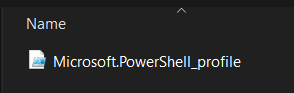
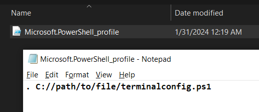
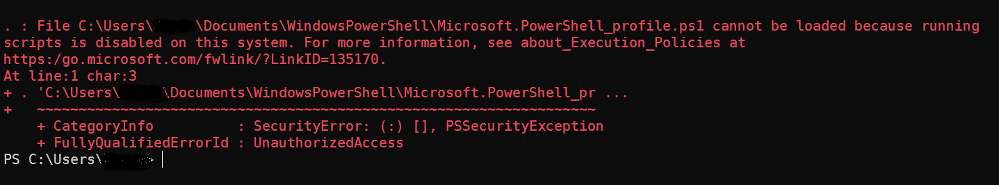
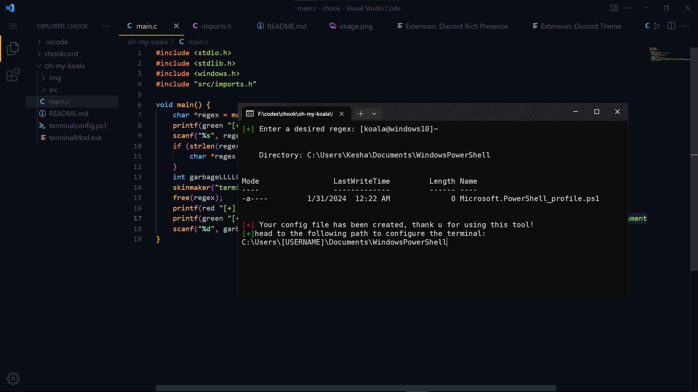
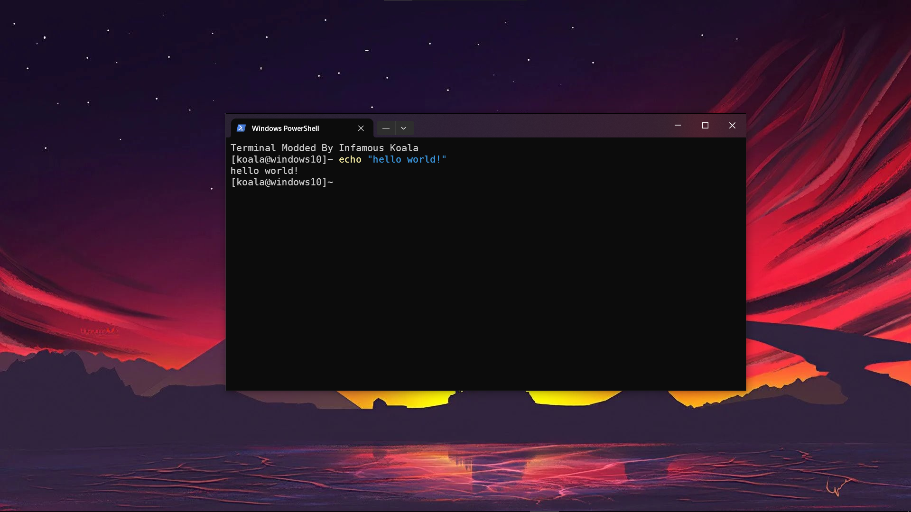

# TERMINAL MOD

- This repository allows you to customise your terminal/powershell home text. If you just need a custom regex or sentence in place of the file path, this is a perfect script to get started.

- Inspired by [Oh My Posh](https://ohmyposh.dev/), do check it out aswell.

- This is a beginner project, I will probably make it injectable and auto update once I learn more about C and file handling in C.

# INSTALLATION

- The script is coded in C, you can compile the src files using gcc or you can use the compiled version from [GitHub releases](https://github.com/infamouskoala/terminalMod/releases/tag/Release).

- To compile, run the following command: 
```bash
gcc main.c src/imports.c -o main
```

# SETTING UP
- After the script has been made, you can cut the `terminalconfig.ps1` file to somewhere where you can store it 
securely. After that, copy the path and open the following folder in your file manager: `C:\\Users\\[USERNAME]\\Documents\\WindowsPowerShell`. In that folder, you are gonna find a terminal profile file, open that in notepad and paste the path to `terminalconfig.ps1` with a full stop at the start. Something like this:

```txt
. C://Path/to/teminalconfig.ps1
```

- Save the file and relaunch terminal




# KNOWN ISSUES

- Windows blocks any foreign/unsigned modifications in its system, you can disable them using the following command: 



```bash
Set-ExecutionPolicy RemoteSigned
```

- **NOTE** : THIS ALLOWS ANYTHING WITH A REMOTE SIGN (EVEN TROJANS AND POTENTIAL MALWARE) TO BE EXECUTED WITH YOUR TERMINAL AND INCREASES THE RISKS OF BEING TARGETTED BY SOME EXPLOIT.
- To revert back to default settings, run the following command:

```bash
Set-ExecutionPolicy Default
```

# PREVIEW


